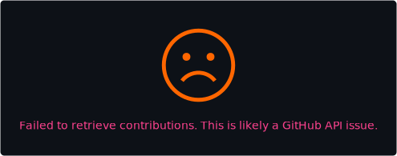
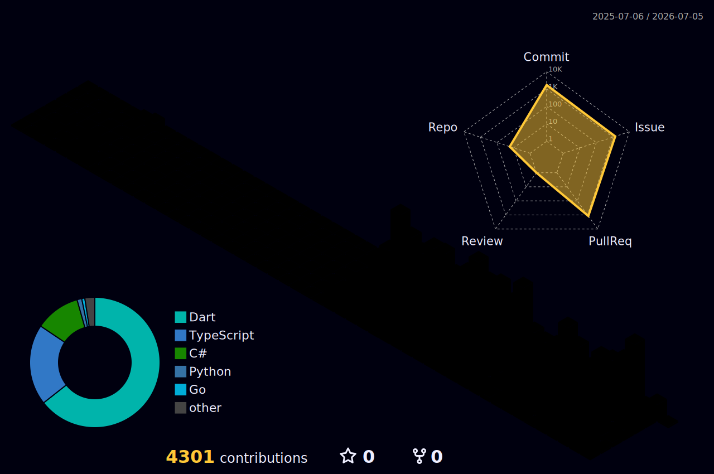

<!-- Header -->
<div align="center">

```
╔══════════════════════════════════════════════════════════════════╗
║                                                                  ║
║   ██████╗██████╗ ██╗   ██╗██╗    ██╗ █████╗ ██╗   ██╗           ║
║  ██╔════╝██╔══██╗██║   ██║██║    ██║██╔══██╗╚██╗ ██╔╝           ║
║  ██║     ██████╔╝██║   ██║██║ █╗ ██║███████║ ╚████╔╝            ║
║  ██║     ██╔══██╗██║   ██║██║███╗██║██╔══██║  ╚██╔╝             ║
║  ╚██████╗██║  ██║╚██████╔╝╚███╔███╔╝██║  ██║   ██║              ║
║   ╚═════╝╚═╝  ╚═╝ ╚═════╝  ╚══╝╚══╝ ╚═╝  ╚═╝   ╚═╝              ║
║                                                                  ║
║              ⚔️  BACKEND ENGINEER  ×  GAME DEV  ⚔️               ║
║                    📍 Tokyo, Japan 🇯🇵                            ║
║                                                                  ║
╚══════════════════════════════════════════════════════════════════╝
```


</div>

---

## 🎮 `> SELECT YOUR HERO`

```
┌─────────────────────────────────────────────────────────────┐
│                                                             │
│  NAME .......... cruway                                     │
│  CLASS ......... Backend Engineer                           │
│  LOCATION ...... Tokyo, Japan 🇯🇵                           │
│  STATUS ........ Crafting AI-powered worlds                 │
│                                                             │
│  ─────────────────────────────────────────────              │
│                                                             │
│  Backend engineer by day, game developer by passion.        │
│  Currently obsessed with building things using AI —         │
│  from novel engines to prediction systems.                  │
│                                                             │
│  These days, I'm diving deep into AI-driven architecture    │
│  & design services, studying system design patterns,        │
│  and exploring how AI can reshape the way we build          │
│  software from the ground up.                               │
│                                                             │
│  Always leveling up. Always building something new.         │
│                                                             │
└─────────────────────────────────────────────────────────────┘
```

---

## ⚔️ `> SKILL TREE`

<div align="center">

### 🗡️ Main Class — Backend
[](https://skillicons.dev)

### 🛡️ Sub Class — Frontend & App
[](https://skillicons.dev)

### 🧪 Alchemy — AI & Data
[](https://skillicons.dev)

### 🏗️ Fortress — Infra & DevOps
[](https://skillicons.dev)

### 🔧 Arsenal — Tools & DB
[](https://skillicons.dev)

</div>

---

## 🏰 `> QUEST LOG — Active Projects`

<!-- QUEST_LOG:START -->

<div align="center">

| Status | Quest | Description | Tech | Updated |
|:------:|-------|-------------|------|:-------:|
| 🔥 | **novel_forge** 🆕 | Offline-first visual novel engine with No-Code editor | `Flutter` `Dart` | 1d ago |
| 🔥 | **novel_game** | 月刊アビス — Occult mystery visual novel game | `Flutter` `Dart` `Flame` | 18d ago |
| 🔥 | **devquest** | RPG-style gamified developer task manager | `Flutter` `Flame` `Bonfire` | 1mo ago |
| ⚡ | **japan-loto-predictor** | Lottery prediction engine with statistical analysis | `Python` `AI/ML` | 1mo ago |
| ⚡ | **novel-ai-project** | AI-powered novel auto-generation platform | `AI` `Automation` | 1mo ago |
| ⚡ | **study-tool** 🆕 | System Design Master — interview prep toolkit | `TypeScript` | 2d ago |
| 🛠️ | [**techpulse-blog**](https://github.com/cruway/techpulse-blog) | IT tech trend blog powered by Go + HTMX + n8n | `Go` `HTMX` | 1mo ago |
| 🛠️ | [**workflow-visualizer**](https://github.com/cruway/workflow-visualizer) | Excel-like UI for creating Mermaid diagrams | `TypeScript` `Tauri` | 1mo ago |
| 🛠️ | [**doc-to-markdown-editor**](https://github.com/cruway/doc-to-markdown-editor) | Google Docs → structured Markdown export tool | `TypeScript` | 1mo ago |
| 🎮 | **undead_survive** | Survival hack & slash action game | `Flutter` `Dart` | 3mo ago |

</div>

> 🗝️ *Some quests are hidden in private dungeons...*
<sub>⏱ Auto-generated from `quests.yml` · last update: 2026-05-01 21:41 UTC</sub>

<!-- QUEST_LOG:END -->

---

## 📊 `> PLAYER STATS`

<div align="center">

<!-- GitHub Stats (generated via GitHub Actions with PAT) -->




<!-- Streak Stats -->


</div>

---

## 🏙️ `> 3D CONTRIBUTION CITY`

<div align="center">

<picture>
  <source media="(prefers-color-scheme: dark)" srcset="./profile-3d-contrib/profile-night-rainbow.svg" />
  <source media="(prefers-color-scheme: light)" srcset="./profile-3d-contrib/profile-season-animate.svg" />
  
</picture>

</div>

---

## 🎯 `> NOW LEARNING`

<div align="center">

```
 ╔═══════════════════════════════════════════════════╗
 ║  🧠 System Design & Architecture Patterns        ║
 ║  🤖 AI-Driven Service Design                     ║
 ║  ☸️  Kubernetes & Cloud Native                    ║
 ║  🦀 Rust                                         ║
 ╚═══════════════════════════════════════════════════╝
```

[](https://skillicons.dev)

</div>

---

## 📈 `> ACTIVITY GRAPH`

<div align="center">

[](https://github.com/ashutosh00710/github-readme-activity-graph)

</div>

---

<div align="center">

```
╔═══════════════════════════════════════════════════════╗
║                                                       ║
║   "The code is my sword, AI is my shield."            ║
║                                                       ║
║            GAME OVER? NEVER.                          ║
║            > CONTINUE? [Y/N] █                        ║
║                                                       ║
╚═══════════════════════════════════════════════════════╝
```


</div>
