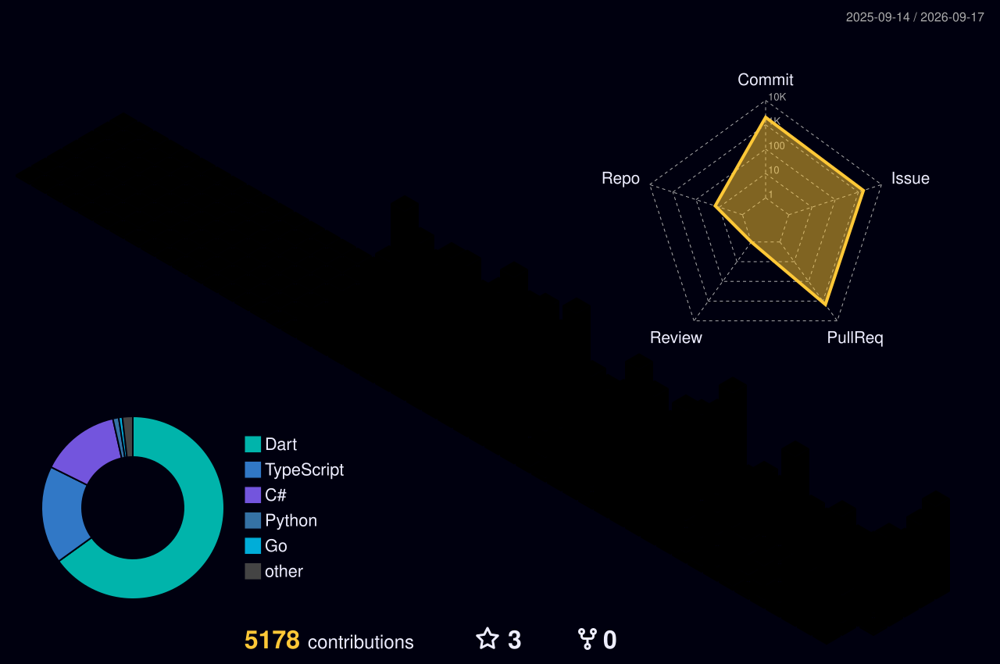

<!-- Header -->
<div align="center">

```
╔════════════════════════════════════════════════════════════════╗
║                                                                ║
║       ██████╗██████╗ ██╗   ██╗██╗    ██╗ █████╗ ██╗   ██╗      ║
║      ██╔════╝██╔══██╗██║   ██║██║    ██║██╔══██╗╚██╗ ██╔╝      ║
║      ██║     ██████╔╝██║   ██║██║ █╗ ██║███████║ ╚████╔╝       ║
║      ██║     ██╔══██╗██║   ██║██║███╗██║██╔══██║  ╚██╔╝        ║
║      ╚██████╗██║  ██║╚██████╔╝╚███╔███╔╝██║  ██║   ██║         ║
║       ╚═════╝╚═╝  ╚═╝ ╚═════╝  ╚══╝╚══╝ ╚═╝  ╚═╝   ╚═╝         ║
║                                                                ║
║       +------------------------------------------------+       ║
║       |   BACKEND ENGINEER   x   GAME DEVELOPER        |       ║
║       |   LOCATION: TOKYO, JAPAN                       |       ║
║       +------------------------------------------------+       ║
║                                                                ║
║                   PRESS  START  TO  CONTINUE                   ║
║                                                                ║
╚════════════════════════════════════════════════════════════════╝
```

`⚔️ BACKEND ENGINEER` · `🎮 GAME DEV` · `📍 TOKYO, JAPAN 🇯🇵`

<!-- HUD:START -->

```
╔════════════════════════════════════════════════════════════════╗
║                                                                ║
║     LV.11   EXP 4,726   REPOS 44   ALLIES 120   QUESTS 10      ║
║                                                                ║
╚════════════════════════════════════════════════════════════════╝
```

<!-- HUD:END -->


</div>

---

## 🎮 `> SELECT YOUR HERO`

<div align="center">

```
╔════════════════════════════════════════════════════════════════╗
║                                                                ║
║  NAME .......... cruway                                        ║
║  CLASS ......... Backend Engineer                              ║
║  SUBCLASS ...... Game Developer                                ║
║  LOCATION ...... Tokyo, Japan                                  ║
║  JOINED ........ 2015                                          ║
║  STATUS ........ Crafting AI-powered worlds                    ║
║                                                                ║
║  ----------------------------------------------------------    ║
║                                                                ║
║  Backend engineer by day, game developer by passion.           ║
║  Currently obsessed with building things using AI --           ║
║  from novel engines to prediction systems.                     ║
║                                                                ║
║  These days I'm diving deep into AI-driven architecture        ║
║  & design services, studying system design patterns, and       ║
║  exploring how AI can reshape the way we build software        ║
║  from the ground up.                                           ║
║                                                                ║
║  Always leveling up. Always building something new.            ║
║                                                                ║
╚════════════════════════════════════════════════════════════════╝
```

</div>

---

## ⚔️ `> SKILL TREE`

<div align="center">

### 🗡️ Main Class — Backend
[](https://skillicons.dev)

### 🛡️ Sub Class — Frontend & App
[](https://skillicons.dev)

### 🧪 Alchemy — AI & Data
[](https://skillicons.dev)

### 🏗️ Fortress — Infra & DevOps
[](https://skillicons.dev)

### 🔧 Arsenal — Tools & DB
[](https://skillicons.dev)

</div>

---

## 🏰 `> QUEST LOG — Active Projects`

<!-- QUEST_LOG:START -->

<div align="center">

| Status | Quest | Description | Tech | Updated |
|:------:|-------|-------------|------|:-------:|
| 🔥 | **novel_forge** 🆕 | Offline-first visual novel engine with No-Code editor | `Flutter` `Dart` | today |
| 🔥 | **novel_game** | 月刊アビス — Occult mystery visual novel game | `Flutter` `Dart` `Flame` | 1mo ago |
| 🔥 | **devquest** | RPG-style gamified developer task manager | `Flutter` `Flame` `Bonfire` | 2mo ago |
| ⚡ | **japan-loto-predictor** | Lottery prediction engine with statistical analysis | `Python` `AI/ML` | 3mo ago |
| ⚡ | **novel-ai-project** | AI-powered novel auto-generation platform | `AI` `Automation` | 6mo ago |
| ⚡ | **study-tool** | System Design Master — interview prep toolkit | `TypeScript` | 2mo ago |
| 🛠️ | [**techpulse-blog**](https://github.com/cruway/techpulse-blog) | IT tech trend blog powered by Go + HTMX + n8n | `Go` `HTMX` | 5mo ago |
| 🛠️ | [**workflow-visualizer**](https://github.com/cruway/workflow-visualizer) | Excel-like UI for creating Mermaid diagrams | `TypeScript` `Tauri` | 5mo ago |
| 🛠️ | [**doc-to-markdown-editor**](https://github.com/cruway/doc-to-markdown-editor) | Google Docs → structured Markdown export tool | `TypeScript` | 5mo ago |
| 🎮 | **undead_survive** | Survival hack & slash action game | `Flutter` `Dart` | 7mo ago |

</div>

> 🗝️ *Some quests are hidden in private dungeons...*
<sub>⏱ Auto-generated from `quests.yml` · last update: 2026-09-04 22:47 UTC</sub>

<!-- QUEST_LOG:END -->

---

## 🐍 `> DUNGEON MAP`

<div align="center">

<picture>
  <source media="(prefers-color-scheme: dark)" srcset="https://raw.githubusercontent.com/cruway/cruway/output/github-snake-dark.svg" />
  <source media="(prefers-color-scheme: light)" srcset="https://raw.githubusercontent.com/cruway/cruway/output/github-snake.svg" />
  
</picture>

<sub>🐍 *The serpent devours every contribution · regenerated daily*</sub>

</div>

---

## 📊 `> PLAYER STATS`

<div align="center">

<!-- Self-hosted via .github/workflows/stats.yml (PAT) -->
<picture>
  <source media="(prefers-color-scheme: dark)" srcset="./stats/github-stats.svg" />
  <source media="(prefers-color-scheme: light)" srcset="./stats/github-stats-light.svg" />
  
</picture>

<picture>
  <source media="(prefers-color-scheme: dark)" srcset="./stats/top-langs.svg" />
  <source media="(prefers-color-scheme: light)" srcset="./stats/top-langs-light.svg" />
  
</picture>

<picture>
  <source media="(prefers-color-scheme: dark)" srcset="./stats/streak.svg" />
  <source media="(prefers-color-scheme: light)" srcset="./stats/streak-light.svg" />
  
</picture>

</div>

---

## 🏆 `> TROPHY HALL`

<div align="center">

<!-- Self-hosted via .github/workflows/trophy.yml -->
<picture>
  <source media="(prefers-color-scheme: dark)" srcset="./stats/trophy-dark.svg" />
  <source media="(prefers-color-scheme: light)" srcset="./stats/trophy-light.svg" />
  
</picture>

</div>

---

## 🏙️ `> 3D CONTRIBUTION CITY`

<div align="center">

<picture>
  <source media="(prefers-color-scheme: dark)" srcset="./profile-3d-contrib/profile-night-rainbow.svg" />
  <source media="(prefers-color-scheme: light)" srcset="./profile-3d-contrib/profile-season-animate.svg" />
  
</picture>

</div>

---

## 🎯 `> NOW LEARNING`

<div align="center">

```
╔════════════════════════════════════════════════════════════════╗
║                                                                ║
║  SKILL POINTS ALLOCATED THIS SEASON                            ║
║                                                                ║
║  > System Design & Architecture Patterns                       ║
║  > AI-Driven Service Design                                    ║
║  > Kubernetes & Cloud Native                                   ║
║  > Rust                                                        ║
║                                                                ║
╚════════════════════════════════════════════════════════════════╝
```

[](https://skillicons.dev)

</div>

---

<div align="center">

```
╔════════════════════════════════════════════════════════════════╗
║                                                                ║
║            "The code is my sword, AI is my shield."            ║
║                                                                ║
║                       GAME OVER?  NEVER.                       ║
║                      > CONTINUE? [Y/N] █                       ║
║                                                                ║
╚════════════════════════════════════════════════════════════════╝
```


</div>
